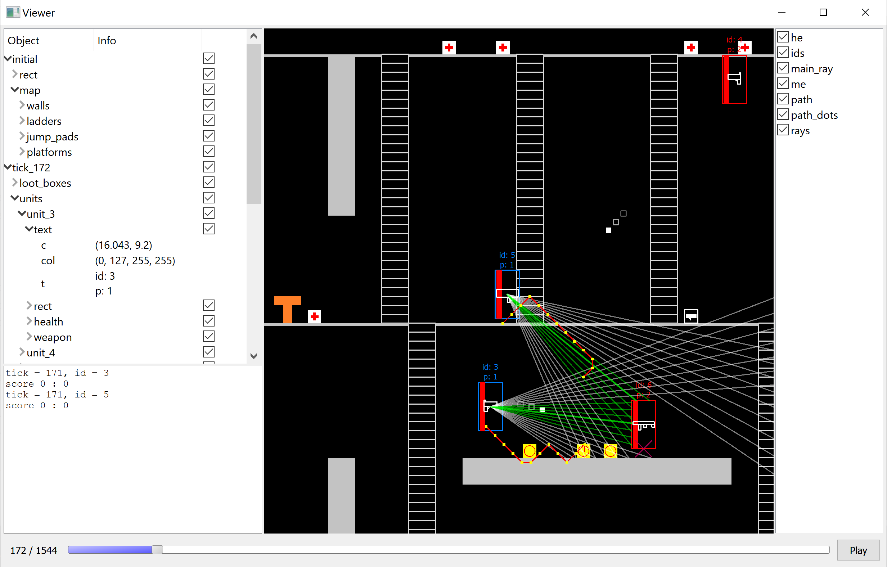

# Viewer

Программа используется при участии в соревнованиях по написанию ботов для игр.
Примеры таких соревнований:
[Russian AI Cup](https://russianaicup.ru/),
[Mini AI Cup](https://aicups.ru/),
[Codingame](https://www.codingame.com/multiplayer).

Основное предназначение программы &mdash; удобная локальная отладка игр, сыгранных ботом.
Для этого нужно запустить программу командой `viewer.exe <log.txt`, где файл `log.txt` содержит информацию для отрисовки.

## Формат входного файла
Файл является обычным текстовым файлом, где каждая строка отвечает за отдельную команду программы.
Файл разбиваетcя на части строкой `tick`.
Перед первой такой строкой можно указать некоторые параметры, а все видимые объекты будут отрисовываться перед каждым кадром.

Пример обычной строки файла: `circle r=20 c=(10,30) col=(255,0,0,127) f=1`
+ Параметры (указываются перед первым `tick`)
  + `size (100,60)` размер игрового поля `100x60`
  + `width 5` ширина линии при отрисовке. По умолчанию 1. Может быть перезаписана параметрами объекта.
  + `speed 60` количество кадров в секунду. По умолчанию 1.
  + `flipy` устанавливает ось `y` сверху вниз. Если такой строки нет, ось `y` будет направлена снизу вверх
  + `font 10` размер шрифта
+ Объекты (указанные перед первым `tick` будут отрисованы в начале каждого кадра, остальные только на соответствующем кадре).
Общий формат `<object_name> <parameter_1>=<value_1>  <parameter_2>=<value_2>`
  + Возможные типы параметров
    + `<name>=(20.1,10.9)` точка/вектор
    + `<name>=20` целое число
    + `<name>=3.14` дробное число
    + `<name>=(255,0,0,127)` цвет в формате RGBA, прозрачность можно не писать, тогда она будет установлена в 255 (абсолютно непрозрачный)
    + `<name>=sth_without_spaces` строка
  + Возможные объекты и их параметры (все параметры можно не указывать, но вместо них будут использованы значения по умолчанию,
  но если не указать width, будет использовано значение из параметров, если оно есть, иначе 1, цвет по умолчанию черный)
    + `rect` прямоугольник
      + `c` точка, центр
      + `s` вектор, размер
      + `f` число 0 или 1, закрашивать ли прямоугольник. По умолчанию 0.
      + `w` целое число, ширина линии. Не имеет смысла, если установлено `f=1`
      + `col` цвет, цвет
      + `t` строка, тег, может быть несколько, используется для настройки выборочной отрисовки
    + `circle` круг
      + `c` точка, центр
      + `r` дробное число, размер
      + `f` число 0 или 1, закрашивать ли круг. По умолчанию 0.
      + `w` целое число, ширина линии. Не имеет смысла, если установлено `f=1`
      + `col` цвет, цвет
      + `t` строка, тег, может быть несколько, используется для настройки выборочной отрисовки
    + `line` отрезок
      + `s` точка, начало линии
      + `f` точка, конец линии
      + `w` целое число, ширина линии
      + `col` цвет, цвет
      + `t` строка, тег, может быть несколько, используется для настройки выборочной отрисовки
    + `poly` ломаная или многоугольник
      + `p` точка, вершина ломаной, может быть указано несколько
      + `f` число 0 или 1, отличающее ломаную от многоугольника. По умолчанию 1, что означает многоугольник.
      В этом случае последняя заданная точка будет соединена с первой, и получившийся многоугольник будет закрашен.
      Иначе будет просто ломаная
      + `w` целое число, ширина линии. Не имеет смысла, если установлено `f=1`
      + `col` цвет, цвет
      + `t` строка, тег, может быть несколько, используется для настройки выборочной отрисовки
    + `text` текст
      + `c` точка, центр
      + `s` дробное число, размер шрифта. Аналогично ширине, если не указано, будет использовано значение из параметров
      + `m` строка, текст. Все символы `;` будут преобразованы в переводы строки
      + `col` цвет, цвет
      + `t` строка, тег, может быть несколько, используется для настройки выборочной отрисовки
    + `group` группа объектов. Можно указывать теги группы. Первое слово после `group` будет названием группы.
    В группу попадут все объекты, расположенные на 1 пробельный отступ правее объявления группы,
    пока не встретится строка с отступом, не меньшим, чем у `group` (Python-style)
    + `msg` сообщение, которое нигде не отрисовывается, но попадает в специальное окно. Также не попадает в `group`.
    Для сообщения будет использоваться вся строка, после слова `msg` и пробела. Каждое сообщение будет находиться на отдельной строке.
    Как и все объекты, будет видимо только на соответствующем тике

## Интерфейс

Слева сверху дерево объектов, можно просматривать параметры или включать и отключать видимость объектов.
Действует только на текущем кадре.

Слева снизу окно для `msg`.

Справа список тегов. Действует на все кадры сразу. Объект отрисовывается, если хоть один из его тегов отмечен.
Но если объект находится в группе, которая не отрисовывается, теги объекта не проверяются, и он не отрисовывается, как и вся группа.

## Управление
Для корректной работы клавиш фокус должен находиться на изображении (надо кликнуть по нему)
+ Стрелками влево/вправо можно перемещаться между кадрами
+ Пробел или `P` для запуска или остановки воспроизведения
+ колесиком мыши можно менять размер изображения, курсором двигать
+ `=` (клавиша с символом `+`) для увеличения изображения, `-` для уменьшения
+ `0` для расположения изображения по центру с максимально возможным размером, чтобы изображение не вылезало за кадр
+ `R` переключение на первый кадр
+ `F` раскрыть окно на весь экран, а затем применить действия клавишы `0`

## Сборка и запуск
Для сборки нужен `qmake` и `make`.
Запуск производится командой `viewer.exe < log.txt`, где файл `log.txt` содержит информацию для отрисовки.
